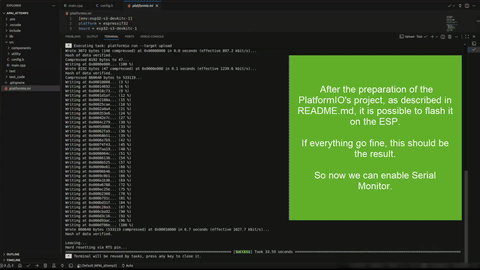
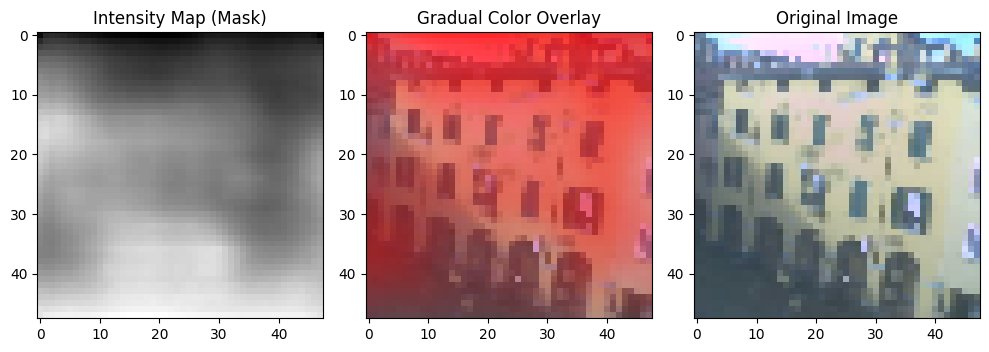
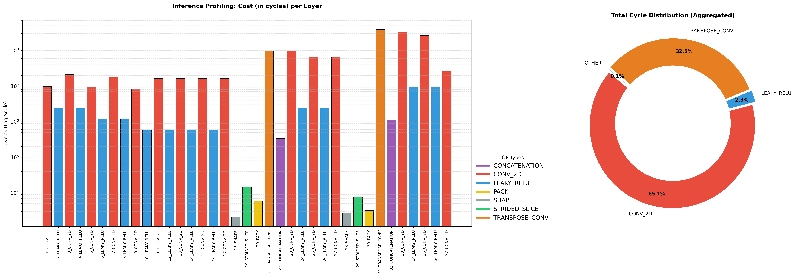

# Porting uPyDnet to ESP32-S3 with MicroTFLite

> **Abstract**
> This project documents the miniaturization and deployment process of the **uPyDnet** neural network, originally developed in an academic setting and adapted here in collaboration with PhD students from the *Architectures and Platforms for Artificial Intelligence* course, on the **[Freenove ESP32-S3 CAM](https://freenove.com/fnk0085)** board. The goal is to demonstrate the feasibility of executing complex tasks like *Monocular Depth Estimation* on commercial embedded hardware, leveraging modern conversion and optimization frameworks for Edge AI.

*Process demo (from flashing to execution):*

(see `./images/video.mp4` to watch better this animation)
## 1. Introduction

The main objective of this project is to practically apply the concepts of neural network miniaturization learned during the university course **[Architectures and Platforms for Artificial Intelligence](https://www.unibo.it/en/study/course-units-transferable-skills-moocs/course-unit-catalogue/course-unit/2025/446607), module 2**.
The model was proposed by the course's PhD team and consists of a *Monocular Depth Estimation* network.

### Context: The uPyDnet Network

*Monocular Depth Estimation* networks estimate a "depth map" from a single RGB image. Compared to stereo vision or LiDAR sensors, using a single neural network drastically reduces hardware costs and complexity.

The chosen network, **uPyDnet**, is a natively *ultra-lightweight* architecture designed to accept **48x48 pixel** RGB images as input. It was created for integration into high-performance but resource-constrained *embedded* devices (such as PULP processors). The version used in this project was trained on the **KITTI** dataset (*Autonomous Driving* scenario).

The challenge was adapting this model through quantization and conversion to run on *commodity* hardware like the ESP32-S3, analyzing the impact of individual operations on CPU clock cycles.

### Repository Structure

The project is divided into three logical phases:

1. **`model2h`**: Pipeline for model miniaturization and conversion.
2. **`PlatformIO`**: Firmware for injecting the model and executing it on the ESP32-S3.
3. **`quality_check`**: Tools for verification, result visualization, and profiling.

---

## 2. Hardware Configuration and Camera Management

The firmware, contained in the `PlatformIO` folder, was developed specifically for the **ESP32-S3 CAM** board. However, the code structure (particularly the configuration header files) should be generic enough to be adapted to other camera-equipped boards by modifying the macros in the `.h` files.

### Camera Management and Preprocessing

To ensure optimal input for the neural network, the camera is configured to acquire images at **240x240** resolution. Although the sensor supports higher resolutions, this choice allows for clean integer downsampling.
The image is reduced to **48x48** (the input required by uPyDnet) using a **5x5 sliding window** algorithm: the mask slides over the original image without overlapping, sampling exclusively the central pixel. This approach reduces computational cost compared to bilinear interpolation while retaining sufficient spatial information for the network.

---

## 3. Model Miniaturization (`model2h`)

Half of the work in this project involved transforming the network weights into C++ files compatible with the **MicroTFLite** (TensorFlow Lite for Microcontrollers) framework.

### 4.1 Python Environment Setup

The `model2h` folder contains the `update_env.sh` script. This sets up the environment by installing dependencies for both ONNX and Torch pipelines (it assumes a `venv` or `conda` virtual environment is already active).

### 4.2 Dataset Generation (Calibration)

For efficient conversion (especially for `int8` quantization), a "Representative Dataset" is required. Images were extracted from the [Indoor Scenes CVPR 2019](https://www.kaggle.com/datasets/itsahmad/indoor-scenes-cvpr-2019?resource=download) dataset.
*Note:* Any dataset of real scenes is valid for statistical calibration of activation ranges, regardless of the network being trained on KITTI. The images are processed with the same 240x240  48x48 cropping used on the ESP32.

### 4.3 Conversion Mechanism

The system supports two pipelines:

#### A. ONNX Pipeline (Generally Recommended)

Load the `.onnx` model into `./model2h/onnx`. This phase leverages **`onnx2tf`**, the *de facto* standard for converting complex models, mainly because it does not require redefining the model and is generally easily reusable.

> **Technical note on channels:** 3x3 convolutional kernels on 3 channels (RGB) can cause memory misalignment or ambiguity in dimension interpretation (H, W, C) by converters. To overcome this, a **dummy fourth channel** was inserted before conversion. In the ESP32 firmware, this fourth channel is artificially injected into the tensor input.

> **$\color{red}{\text{WARNING}}$**: Despite multiple efforts and attempts, this path was not found to be ideal for the chosen model. The implementation adding a dummy fourth dimension has been left as it could serve as inspiration, but **for executing this project, it is suggested to follow the other path.** This will be surelly one of the main problem problem to solve as soon as possible

#### B. PyTorch/Weights Pipeline

Requires manual redefinition of the architecture in the `convert_pt_to_keras_to_tflite.py` script, but it is impossible to fail with this methodology. By modifying `create_keras_model()`, the topology is forced to ensure a 1:1 conversion of the `.pth` weights. In short, although more verbose, this path offers total control over the graph structure.

### 4.4 Header Generation

The `exec_xxd.sh` script uses `xxd` to convert the `.tflite` into a Hex Dump, separating declarations (`.h`) from definitions (`.cpp`) to optimize compilation times.

---

## 5. Injection and Execution (`PlatformIO`)

This section describes the firmware compilable via **PlatformIO**.

### Folder Structure

* **`test_code`**: Code to validate PSRAM, Camera, and SD Card. *Credits: derived from [Freenove](https://docs.freenove.com/projects/fnk0085/en/latest/) tutorials*.
* **`OOP_NO_TFLite`**: "Skeleton" version (without neural network inference) for debugging application logic without any overhead due to the compilation of the MicroTFLite library.
* **`OOP_TFLite`**: **Main Project**.

### Setup Instructions (`./OOP_TFLite`)

The definitive source code is in `./PlatformIO/OOP_TFLite`.

0. **Creation:** Create a PlatformIO project (select your board, but this shouldn't be a blocking choice as board specs will be overwritten by the next step), and, when it is done, essentially substitute src dir generated into the PlatformIO project with the content of `./PlatformIO/OOP_TFLite/src`.
1. **Configuration:** Replace the default generated `platformio.ini` with the one present in this folder.
2. **Weight Import:** Copy the generated `.h` and `.cpp` files (from `./model2h/result_to_move`) into `./src/components/neural_model/model_data/`.
3. **Model Selection:** Go to `config.h` in the `./src` root to activate the macro for the model generated in the previous paragraph (note: it is suggested to change the automatically generated tag if not already done).
4. **Pipeline Configuration:** In `./src/config.h`, besides the correct model, you must enable the correct macro:
* `#define USING_ONNX` (activates 4-channel padding).
* `#define USING_TORCH` (standard 3-channel input).

> **Note:** The project already includes a pre-loaded and functioning model. The steps above are necessary only to update the neural network with a custom one. But otherwise it is enought only point 0 and 1

---

## 6. Result Verification (`quality_check`)

To validate inference, the firmware saves four files to the SD Card for each shot:

1. **RAW JPEG**: Original 240x240 image.
2. **RGB888**: Uncompressed conversion (ground truth).
3. **Input Network**: Downscaled 48x48 image.
4. **Depth Map**: Network output (grayscale 0-255).

(Refer back to the beginning gif to better understand what is meant)

These photos can be copy-pasted from the SD to the computer to be studied, specifically in the `quality_check/img` folder of this repo, and "analyzed" by the paired `quality_check.ipynb` file.

### Qualitative Analysis

Since it is difficult to judge what the model actually considered far or near, the Python Notebook in `quality_check` overlays the *Depth Map* on the original image, generating a **heat-map** (with red indicating areas estimated as "far").

Below a quick example:

### Cycle Profiling

Leveraging **MicroTFLite**'s built-in profiler integration, it was possible to analyze the computational load distribution across the various network layers:

**Chart Analysis:**
The pie chart (right) and logarithmic histogram (left) clearly highlight the architecture's bottlenecks on ESP32 hardware:

1. **Convolution Dominance:** As expected, most cycles are spent in `CONV_2D` operations (see color $\color{red}{\text{red}}$).
2. **Upsampling Impact:** A very interesting data point is the huge impact of `TRANSPOSE_CONV` (see color $\color{orange}{\text{orange}}$). Although numerically few compared to other layers, they occupy a third of the total inference time. These operations are crucial for the image "decoding" phase to restore it to the original (or near-original) depth map size.
3. **Activation Efficiency:** The `LEAKY_RELU` and `PACK` operations (in $\color{azure}{\text{azure}}$ and $\color{yellow}{\text{yellow}}$) have a negligible impact (< 3%), demonstrating that the overhead introduced by non-linear activation functions is minimal on this architecture.

This analysis suggests that future optimizations should focus on efficient implementation or replacement (e.g., via *resize-convolution*) of Transpose Convolution layers.

### Other Performance Reflections

In addition to procedure counters and a subjective quality analysis, we can report these final metrics and specifications with the code defined and tested so far on **Freenove ESP32-S3**:

* **Total Cycle Time:** A complete iteration (photo capture, preprocessing, inference, saving to SD) takes approximately **6-7 seconds** (generally around 6200ms).
This was achieved by keeping the `TIME_COUNT` flag active in the `config.h` file present in the firmware.
* **Interaction:** Acquisition is triggered by pressing the **BOOT** button integrated on the board, maximizing project portability.

---
## References and Publications

This work uses various tutorials found online, primarily the one downloadable from Freenove, but is rooted in the following research works:

* **Original Network (uPyDnet/PyDnet):**
F. Aleotti, F. Tosi, M. Poggi, S. Mattoccia, *"PyDnet: Real-time Monocular Depth Estimation on Embedded Platforms"*, in IEEE Transactions on Intelligent Transportation Systems, 2021.
[IEEE Xplore](https://ieeexplore.ieee.org/abstract/document/9422776)
* **Hardware-Aware Optimization Techniques:**
M. Risso, A. Burrello, L. Benini, et al., *"Pruning In Time (PIT): A Lightweight Network Architecture Optimizer for Temporal Convolutional Networks"*, in Design, Automation & Test in Europe (DATE), 2020.
[Google Scholar](https://scholar.google.com/citations?view_op=view_citation&hl=it&user=QotA2soAAAAJ&citation_for_view=QotA2soAAAAJ:zYLM7Y9cAGgC)